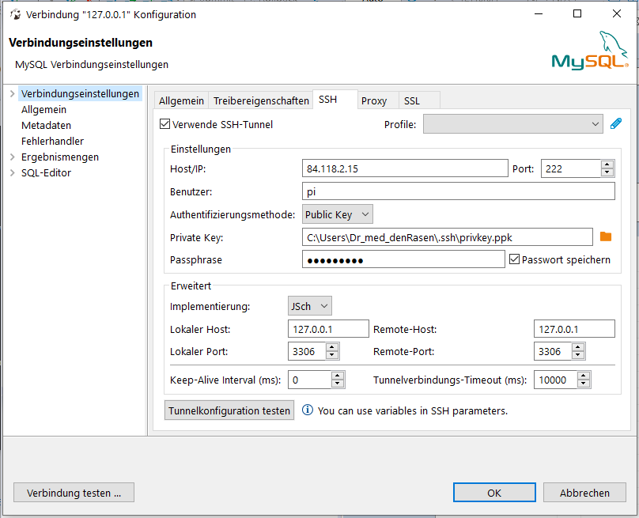
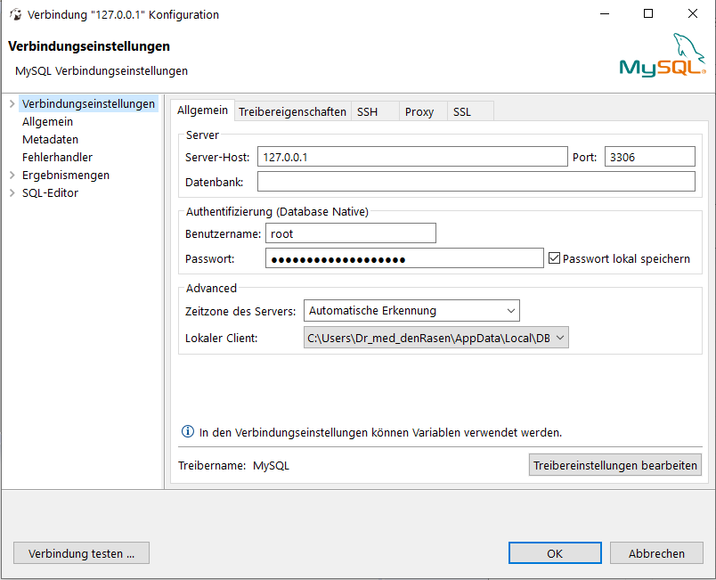

# Backend Team

Name | Nickname | GitHub Nick | Rolle
------------ | ------------ | ------------ | ------------
Mathis | Block | vMysterion | Teamleitung
Timo | Kohlmeier | Wambo04 | Entwickler
Lukas | Hitzemann | Batschko | Entwickler
Anestis Lalidis | Mateo | Nesti024 | Entwickler
Sebastian | Steinmeyer | CrappyAlgorithm | Entwickler
Julian | Wasilewski | JulianWasilewski | Entwickler

# Abhängigkeiten installieren:
- Über pip die requirements.txt als Quelle nutzen, um die Abhängigkeiten zu installieren
```
$ pip install -r requirements.txt
```

# Einrichtung der Entwicklungsumgebung:
- MariaDB 10.x installieren
-- zur besseren Kompatibilität bitte Nutzer="backend" und Passwort="softwareprojekt2020" erstellen
-- bei abweichenden Daten muss dies in der _backend_config.ini_ angepasst werden (bitte nicht commiten!)
- Projekt clonen
- Projektordner in der Konsole öffnen
- Falls nicht vorhanden virtualenv installieren (wird ergänzt falls nötig)
- Virtual Environment anlegen
    - Linux: 
    ```sh
    $ python3 -m venv venv
    ```
    - Windows:
    ```sh
    $ python -m venv venv
    ```
- Virtual Enviroment starten
    - Linux:
    ```sh
    $ source venv/bin/activate
    ```
    - Windows:
    ```sh
    $ .\venv\Scripts\activate.bat
    ```
- Nun sollte vor dem Komandozeilenpromt (venv) erscheinen
- Installieren der notwendigen Pakete
    - Linux: 
    ```sh
    $ pip3 install -r requirements.txt
    ```
    - Windows:
    ```sh
    $ pip install -r requirements.txt
    ```

# Starten der Anwendung:
- In der Konsole ins Hauptverzeichnis des Projekts wechseln
- Virtual Enviroment starten
    - Linux:
    ```sh
    $ $ source venv/bin/activate
    ```
    - Windows:
    ```sh
    $ .\venv\Scripts\activate.bat
    ```
- Setzen von 2 Enviroment Variablen
    - Linux: 
    ```sh
    $ export FLASK_APP=backend
    $ export FLASK_ENV=development
    ```
    - Windows:
    ```sh
    $ set FLASK_APP=backend
    $ set FLASK_ENV=development
    ```
- Nun kann die Anwendung wie folgt genutzt werden
```sh
$ flask <Befehl>
```

# Mögliche Befehle
Befehl | Beschreibung
--- | ---
run | startet das Backend
init-db | initialisiert bzw bereinigt die Datenbank

# Startparameter für run
Parameter | Beschreibung
--- | ---
-h host-ip :text | Angabe der Socket-IP. Mögliche externe IP's können mit ifconfig eingesehen werden.
-p port :integer | Angabe des Socket-Port.

# Raspberry Testumgebung
Der Zugriff ist nur mittels Schlüssel basierter Authentifikation möglich. Wer Zugriff haben möchte kann mir seinen öffentlichen Schlüssel schicken. Bei Fragen bitte an CrappyAlgorithm (Sebastian Steinmeyer) wenden.

## SSH Zugriff 
- falls nicht vorhanden SSH Client installieren (für Windows z.B. Putty)
Verbindungsdaten:
```
IP: 84.118.2.15
Port: 222
User: pi
```

## Datenbankzugriff
Der Zugriff auf die Datenbank ist per SSH-Tunnel möglich. Im folgenden wird die Einrichtung unter [DBeaver](https://dbeaver.io/) beschrieben, da dies für alle gängigen Betriebssystemen vorhanden ist.

- Auf den Stecker mit dem grünen Plus klicken, um eine neue Datenbankverbindung einzurichten



Unter "Einstellungen" müssen die Daten für den SSH Zugriff eingetragen werden. Das hier angegebene Passwort, ist das dem Schlüssel zugehörige.

Unter "Erweitert" wird der SSH Tunnel eingerichtet. Die Angaben für "Remote-Host/-Port" bitte nicht verändern. Die Angaben für "Localer-Port" müssen angepasst werden, wenn bereit eine Datenbank bzw. eine andere Anwendung den Port verwendet.

Nun kann "Tunnelkonfiguration testen" verwendet werden, um die erfolgreiche Einrichtung zu validieren.



Unter Server werden nun die Daten für den Lokalen-Host/-Port aus der Einrichtung des SSH Tunnels verwendet. Das Feld Datenbank kann genutzt werden, um sich nur mit einer Spezifischen Datenbank (Schema) zu verbinden.
Unter Authentifizierung müssen die localen Nutzerdaten für den Datenbankzugriff auf dem Raspberry verwendet werden. Diese Daten können bei CrappyAlgorithm (Sebastian Steinmeyer) erfragt werden.

Anschließend können wir über "Verbindung testen" die erfolgreiche Einrichtung der Verbindung validieren und bei Erfolg die Einrichtung mit "OK" abschließen.

## Backend
Ein Neustart ist nur notwendig, um eine neue Version zu deployen oder die Datenbank neu zu initialisieren.

Das Backend ist unter folgenden Verbindungsdaten erreichbar:
```
IP: 84.118.2.15
Port: 80
```

### Neue Version Deployen

- gunicorn beenden
```sh
$ sudo systemctl stop backend
```
- neue Backend Version pullen
```sh
$ cd ~/Backend/
$ git stash      // um die Modifikationen zurückzusetzen
$ git pull
```
- Konfiguration wiederherstellen
```sh
$ cp ~/backend_configs/backend_config.ini ~/Backend/backend_config.ini
```
- den Secret Key unter ~/backend_configs/secret_key in der Datei ~/Backend/backend/__init__.py setzen
- falls gewünscht kann die Datenbank neu initialisiert werden
```sh
$ cd ~/Backend
export FLASK_APP=backend
flask init-db
```
- Server starten
```sh
$ sudo sytemctl start backend
```

## Etherium Private Keys
- Die Schlüssel sind in der Datei "/home/pi/backend_configs/nohup.out"zu finden


# Code linting, Statische Analyse und testing
- Zum testen vor einem PR bitte mit:
    - Linux:
    ```sh
    $ ./CI.sh
    ```
    - Windows:
    ```sh
    $ CI.bat
    ```
    prüfen ob keine Fehler mehr da sind.

## Code testing allein
```sh
$ pytest -v
```

### Smartcontracts
siehe [hier](backend/smart_contracts/TEST.md)
